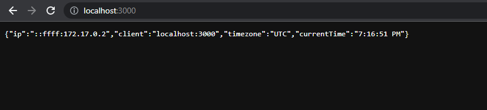

# Laboratoria 1 Programowanie FullStack w chmurze
## Filip Jaślikowski
### 1. Proszę napisać program serwera (dowolny język programowania) [...]
Opracowany został serwer node (w pliku main.js kod serwera), który wyświetla JSON :



komendy potrzebne aby uruchomic:
```sh
npm i 
npm run start
```

### 2. Opracować plik Dockerfile [...]
Plik Dockerfile opracowany, wrzucony do katalogu root repozytorium. 

### 3. Należy podać polecenia niezbędne do[...]
```sh
docker build . -t zad1 
docker run -p 3000:3000 -d --name serwer zad1
```

Po wpisaniu obu komend, powinno wyświetlić się nam ID. Po wpisaniu komendy: 
```sh
docker logs e3fc  
```
gdzie 4 znaki to pierwsze znaki ID, powinna wyswietlic sie nam informacja z logów:
> PORT:3000
> STUDENT:Filip Jaslikowski
> DATA:May 26, 2022
> GODZINA:7:16:51 PM

do sprawdzenia, ile zostało wygenerowanych warstw, należy użyć komendy:
```sh
docker history zad1 
```
Screen z przeglądarki wrzucony powyżej (w podpunkcie 1.)
